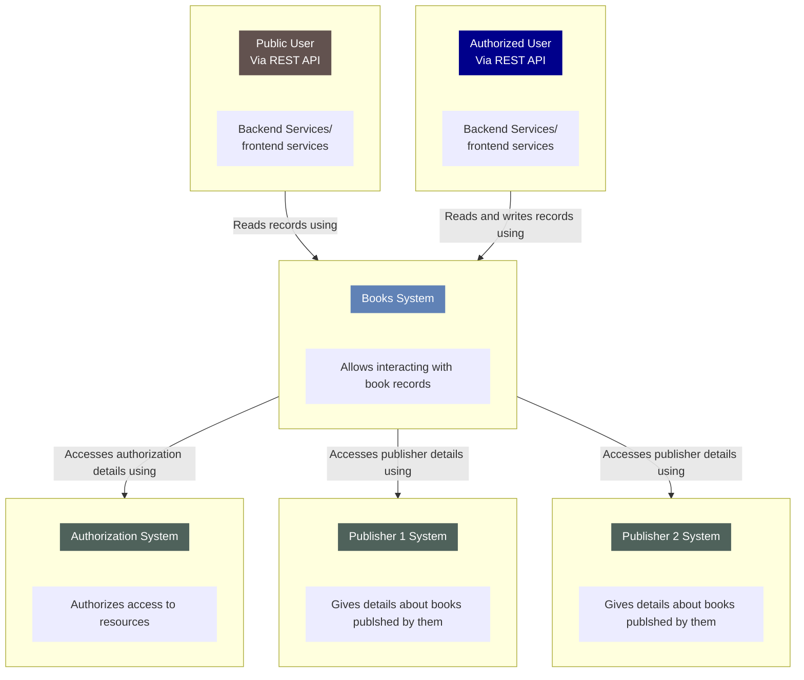

# SDD C4 model

Persons/ext interaction: However you think about your users (as actors, roles, personas, etc), people are the various human users of your software system.

- Software System: A software system is the highest level of abstraction and describes something that delivers value to its users, whether they are human or not. This includes the software system you are modelling, and the other software systems upon which your software system depends (or vice versa).
- Container: A container is essentially a context or boundary inside which some code is executed or some data is stored. And each container is a separately deployable/runnable thing or runtime environment, typically (but not always) running in its own process space. Because of this, communication between containers typically takes the form of an inter-process communication.
- Server-side web application: A Java EE web application running on Apache Tomcat, an ASP.NET MVC application running on Microsoft IIS, a Ruby on Rails application running on WEBrick, a Node.js application, etc.
- Client-side web application: A JavaScript application running in a web browser using Angular, Backbone.JS, jQuery, etc).
- Client-side desktop application: A Windows desktop application written using WPF, an OS X desktop application written using Objective-C, a cross-platform desktop application written using JavaFX, etc.
- Mobile app: An Apple iOS app, an Android app, a Microsoft Windows Phone app, etc.
- Server-side console application: A standalone (e.g. "public static void main") application, a batch process, etc.
- Microservice: A single microservice, hosted in anything from a traditional web server to something like Spring Boot, Dropwizard, etc.
- Database: A schema or database in a relational database management system, document store, graph database, etc such as MySQL, Microsoft SQL Server, Oracle Database, MongoDB, Riak, Cassandra, Neo4j, etc.
- Blob or content store: A blob store (e.g. Amazon S3, Microsoft Azure Blob Storage, etc) or content delivery network (e.g. Akamai, Amazon - CloudFront, etc).
- File system: A full local file system or a portion of a larger networked file system (e.g. SAN, NAS, etc).
- Shell script: A single shell script written in Bash, etc.
- etc
  Component

# Additions to c4

Restrictions, limitations, and constraints
Testing Issues
Classes of tests
Expected software response
Performance bounds
Identification of critical components
Appendices
Requirements traceability matrix
Packaging and installation issues
Design metrics to be used
Supplementary information (as required)

# example in mermaid

